+++
title = "How I Bypassed DoveRunner RASP"
date = 2026-06-28
draft = false
+++

I have been wanting to try Android Application Testing for a long time, but I also used to push it away saying Java is scary and I don't understand it well. I know, silly.


This all started when I had to test an application - can't say it's name but. So this time I had prepared myself to see it through and through.

I'll go step-by-step what I did, what problems I faced and the solutions for those problems.

### DECOMPILE HER 

Get the app from the Google PlayStore. Decompile it using `jadx` which turns the `.dex` file back into readable Java and `apktool` which gives the manifest and resources as text.

```
jadx  --output-dir jadx_output/  base.apk split_config.arm64_v8a.apk
apktool d base.apk -o decoded/
```

Then look into the manifest.

```
<meta-data android:name="AppSecurity" android:value="DoveRunner"/>
<meta-data android:name="drawpanel"   android:value="true"/>
<activity android:name="sr.hkesg"/>
```

This had a few interesting things:
 - `AppSecurity=DoveRunner` means DoveRunner, which is a RASP (Runtime Application Self-Protection) which means anti-tamper, anti-debug, root + emulator detection, and more.
 - `drawpanel=true` which means there'll be a `libdrawpanel.so` simply, this is where DoveRunner's RASP is.
 - and `sr.hkesg` this looks like something random.

The native libraries confirms it.

```
ls decoded/lib/arm64-v8a/
```

```
libdrawpanel.so        ← the detection engine or RASP
```

And the version.

```
grep -rn "BUILD_VERSION" jadx_output/sources/bz/
```

```
public static final String BUILD_VERSION = "3.1.0.0";
```

Everything is specific to DoveRunner 3.1.0.0 — the detection codes, the kill mechanism, the layout, all of it changes between versions.

### THE PART WHICH CONFUSED ME THE MOST!

I assumed, which was my mistake that while running the app on a rooted emulator the app closes itself instantly, so I assumed it must be calling something like `kill()` or `exit()` or `abort()` so I'll just hook those, sounds the most simple way right?

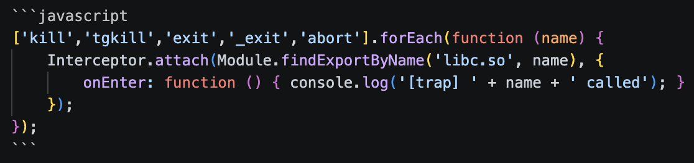
{.big}

Ran the app again but still the app died at ~5 seconds. What was confusing me was nothing was being printed at the moment the app died. So I hooked more functions. Still Nothing. Weird.

My mistake was while hooking the functions I missed a function.

### INSTEAD OF GUESSING, USE LOGCAT

Eventually I stopped trying to guess the kill from the code and thought of looking at the logs when the app dies. The kernel always records the exit reason. On Android that's logcat. Filtered the app's security tag and `Zygote` (the process that manages app lifecycles and therefore logs their deaths).

```
adb logcat -c
adb logcat -s AppSecurity:* Zygote:*
```

```
15:30:48  AppSecurity: BUILD VERSION : 3.1.0.0
15:30:53  AppSecurity: Kill Process ..........................[D10002]
15:30:53  Zygote     : Process 4497 exited due to signal 14 (Alarm clock)
```

The above two lines explained it all. `[D10002]` is DoveRunner announcing detection fired. Then `Zygote` names the cause exactly: **signal 14, "Alarm clock."** Signal 14 is `SIGALRM`.

I catalogued a few of the detection codes.

| Code | Meaning | Fires when |
|---|---|---|
| `D10001` | Frida detected | only with Frida attached |
| `D10002` | root or emulator detected | even on a clean launch (no Frida) |
| `D11001` | environment not trusted | similar to D10002 |
| `D70001` | info / report only | always, harmless |

Note: `D10002` fired even with no Frida at all, which means emulator/root detection was separate from the anti-instrumentation stuff.

### WHY I CAN'T HOOK - SIGALRM

`SIGALRM` is a signal the kernel delivers when a timer expires. Somewhere in its detection routine, DoveRunner calls `alarm(1)` — a one-line POSIX request meaning *"kernel, send this process SIGALRM in 1 second."* The call returns immediately; nothing has happened yet, a timer is just armed. And the **default action** for SIGALRM, if no handler is installed (DoveRunner installs none), is: terminate the process.

So the real sequence is:

1. detection fires → `[D10002]`
2. `alarm(1)` arms a 1-second timer, then the routine returns and the app goes back to normal work
3. one second later the kernel timer expires, and the kernel runs SIGALRM's default action — terminate — **itself**

Now let's compare the two kill paths instruction-by-instruction. 

A normal `kill()` runs in user space until the very last moment, and there's a libc function in the path I can hook:

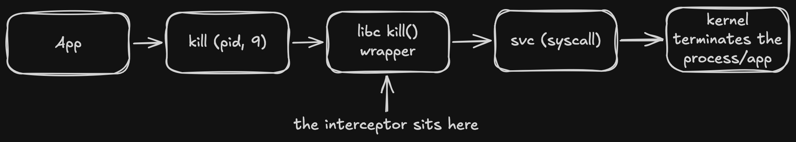
{.big}

The `alarm()` path is shaped completely differently. I *can* hook `alarm()` — but arming the timer isn't the kill. The kill happens later, in the kernel, with no libc call and no syscall *from the app* at the moment of death.

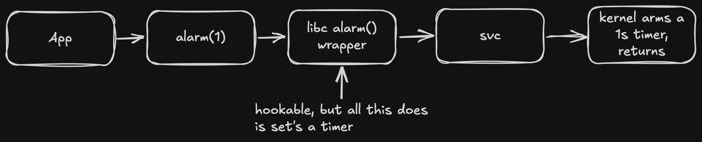
{.big}

    ...1 second passes, app is off doing other things...

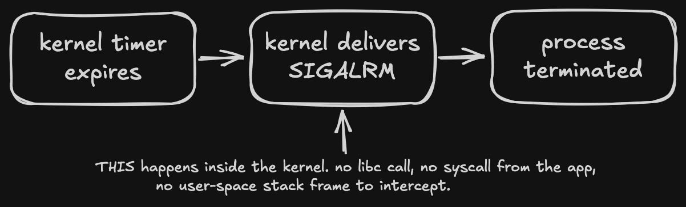
{.big}

A hook can only catch code that runs *in the process*. The termination triggered by SIGALRM runs in the *kernel*, on a timer, a full second after `alarm()` already returned. That's the entire reason blocking `kill`/`exit`/`abort` did nothing — those were never on the critical path.

### BYPASS THE RASP

After understanding this I came to the conclusion that it isn't possible to hook the kernel delivering a signal, so control what's in the user space - stop the timer from ever being armed, and change what SIGALRM *means* to the process so delivering it does nothing. I do both, plus mop up the decoys. This all lives in a self-executing block at the very top of my Frida script (`bypass.js`) so it's in place before DoveRunner's detection thread runs.

    A little helper.

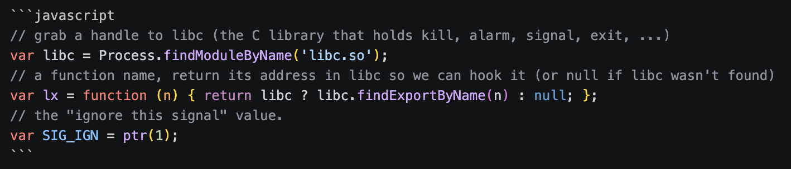
{.big}

**The two that actually matter** — neutralize SIGALRM from both ends:

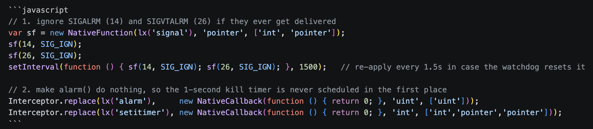
{.big}

Note: I used `Interceptor.replace` and not `attach` because `attach` *wraps* a function — your code runs, but the original logic code still runs, which would still arm the timer. `replace` swaps the implementation entirely so the real `alarm`/`setitimer` never execute. That distinction is the whole point of this hook.

Now also hook the decoys so they don't cause an issue.

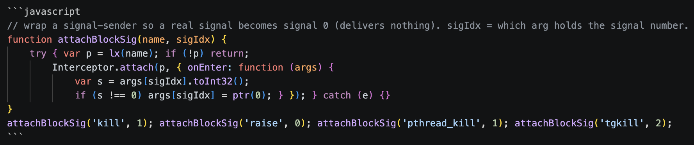
{.big}

Then catch the *inline* kill syscalls — the ones that skip the libc wrappers above. On arm64 the relevant syscall numbers are `kill`=129, `tkill`=130, `tgkill`=131, plus `exit`=93 / `exit_group`=94. I redirect any of those to `getpid` (202), which is the most harmless syscall there is — it just returns the PID and has no side effects:

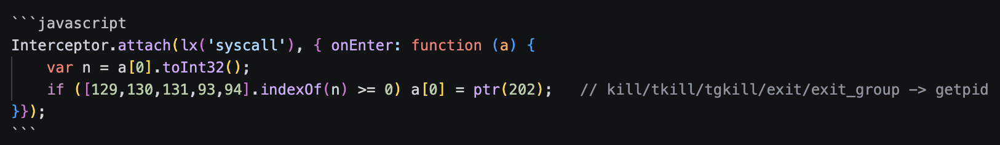
{.big}

Then `exit`/`_exit`/`abort` get fully replaced with a function that *parks* the calling thread — sleeps forever — so the teardown code never runs:

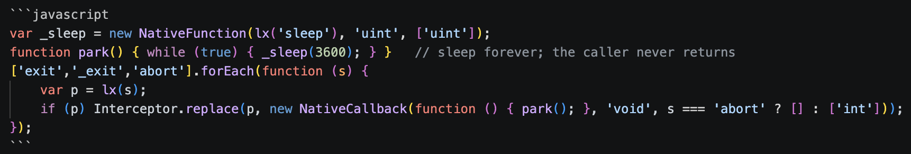
{.big}

And finally `fork`/`vfork`, because some anti-debug tricks fork a child that kills the parent. If a fork returns a child PID (>0, i.e. we're the parent), I kill the child and fake a fork failure (-1)

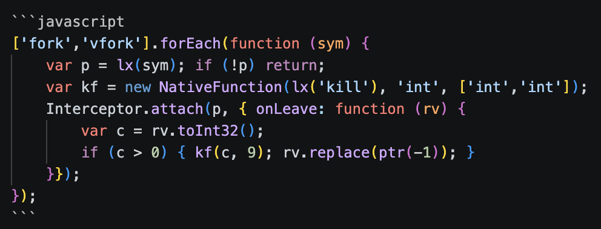
{.big}

Finally, after all this the app does not die.

```
[LEAN] native hooks installed pid=6741
[BEAT] 12s pid=6741     ← still alive; it never used to make it past 5
```

`[BEAT]` is just a heartbeat I print every 5 seconds so I can watch it keep running.

### WHY I COULDN'T JUST REMOVE THE PROTECTION LIBRARY

After I understood that the RASP lives in `libdrawpanel.so`, my monkey brain said let's disable the library. I tried, and the app crashed in a completely different, confusing way that looked unrelated to the protection.

WHY? Because DoveRunner is also a *packer*. The app's string constants are stored encrypted, and they get decrypted at runtime by JNI functions that live in **the same library** as the watchdog. You can see it load at the earliest possible moment — a `static {}` block runs when the `Application` class initializes, before `onCreate`.

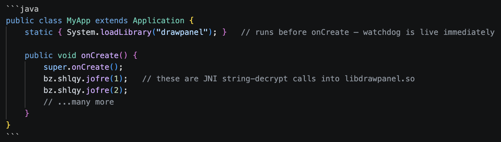
{.big}

The library does two things: act as a watchdog and string decryptor. Break it to stop detection and the app can't decrypt its own strings, so it falls over for "unrelated" reasons a moment later. So the only reliable option is to leave the library running normally and only focus on the part where it terminates the process.

### SIGSEGV made the app FREEZE on the loading screen

The clean way to survive a misbehaving native routine is to catch the crash and skip the faulting instruction. This is the first version.

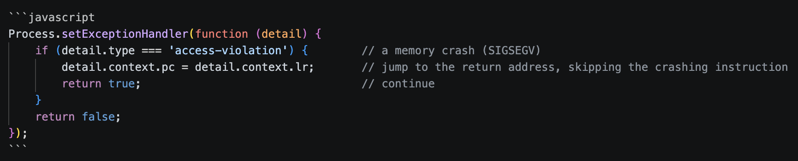
{.big}

This made the app freeze main thread stuck at `futex_wait`, `Java.perform` never returning and UI dead. Process alive but useless.

The reason was really interesting: **Android's runtime (ART) uses SIGSEGV on purpose, as part of running correct code.** 

The clearest example is null checks. In Java, reading a field of a null object must throw `NullPointerException`. Instead of emitting an "is it null?" branch before every single field access (which would run billions of times and almost always be false), ART just does the access. If the object's fine, great, nothing wasted. If it's actually null, the CPU faults reading a tiny address near zero, the kernel raises SIGSEGV, and ART's *own* SIGSEGV handler notices the faulting address is in the null-check range and converts it into a proper NPE. The fault *is* the null check. GC barriers use memory-protection faults similarly.

The fix is to only handle faults that come from inside `libdrawpanel.so` (which sits at one contiguous address range in memory) and let every other fault fall through to ART.

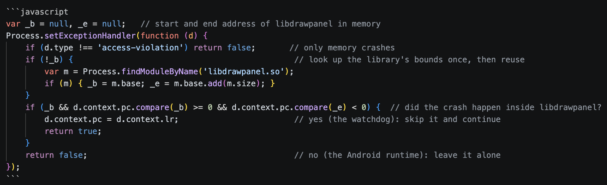
{.big}

Two pointer comparisons. That single boundary check is what finally let the Java half of my script run at all — before it, `Java.perform` never even fired.

### THE JAVA LAYER

With the process surviving and runtime intact, the java-side detection is comparatively easy because it's all reachable through Frida's Java Bridge. There were three detection stacks identified.

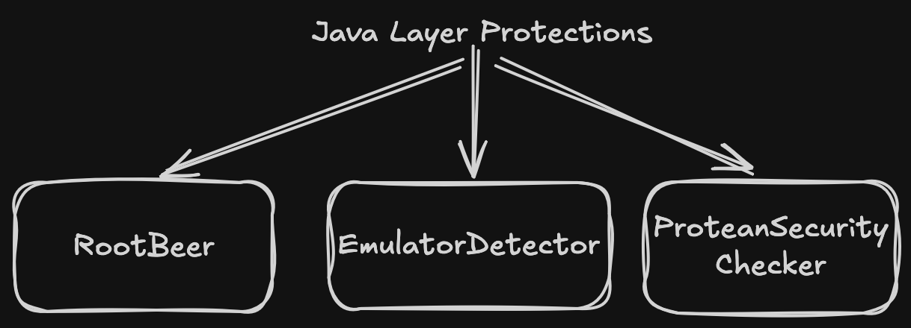

**RootBeer** — the popular open-source root checker (`com.scottyab.rootbeer.RootBeer`). It looks for the `su` binary, dangerous build props (`ro.debuggable=1`, `ro.secure=0`), `/system` mounted read-write, root-manager apps, and `test-keys` in `Build.TAGS`. I force every method that can return a verdict to false.

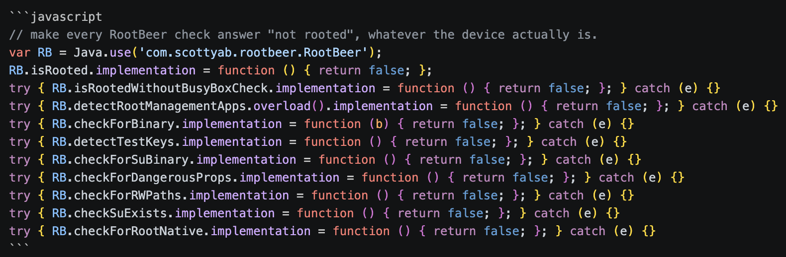
{.big}

Each one's individually `try` - is wrapped because the obfuscated build doesn't always expose every overload, and a missing method shouldn't abort the rest. I back it with a `File.exists` filter so any home-grown path check that doesn't go through RootBeer also comes up empty.

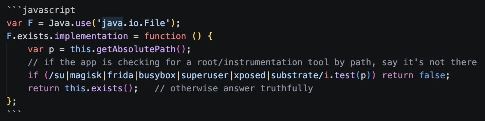
{.big}

**EmulatorDetector** — pure string-matching on the device's build fields. The decompiled `checkBasic()` (it's a Kotlin companion, so it's verbose) looks like

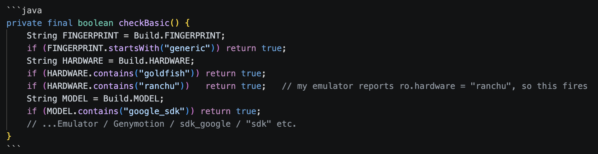
{.big}

My emulator trips several of these (`ro.hardware = ranchu`, `ro.product.model = sdk_gphone64_arm64`). So I stub `detect()` *and* spoof the build fields so anything reading them directly also sees a real phone.

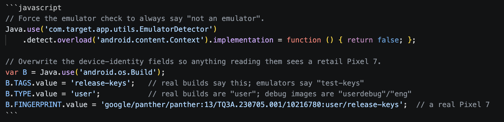
{.big}

**ProteanSecurityChecker** — bundled with an e-sign component (`com.nsdl.egov.esignaar.ProteanSecurityChecker`), six single-letter methods `b`–`g` that check for Frida in `/proc/self/maps`, a debugger, and su. Stub them all.

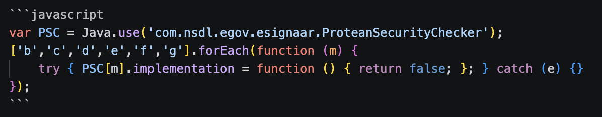
{.big}

### To bypass RootChecker: poison the cache, don't hook the method

The root verdict funnels through a singleton, `RootChecker`, and reading its code carefully is what made this clean. It computes the verdict once on a background thread and caches it in a nullable field.

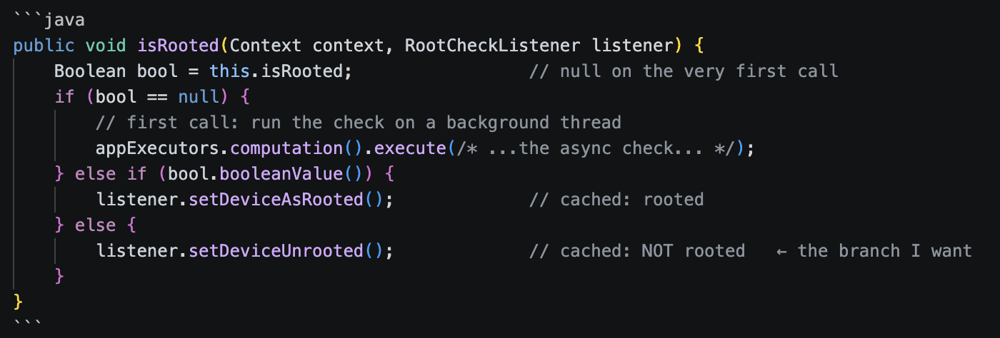
{.big}

and the async body is where the OR lives

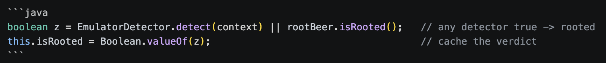
{.big}

The cache was a configuration flaw I think because it made things easier for me as now instead of hooking the method I just set the field to false before the app ever calls it.

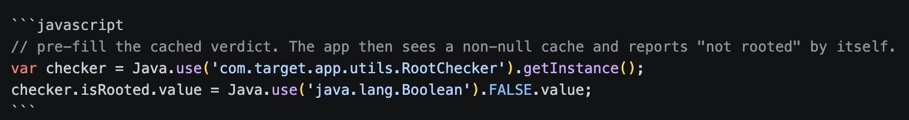
{.big}

I also handled the leftovers. The `sr.hkesg` overlay gets dropped at the framework level across every launch method

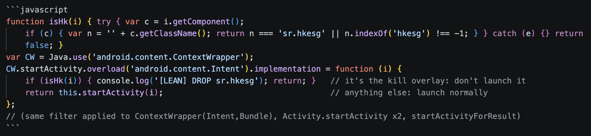
{.big}

And the java-side exits get parked, same idea as the native ones — sleep forever instead of exiting.

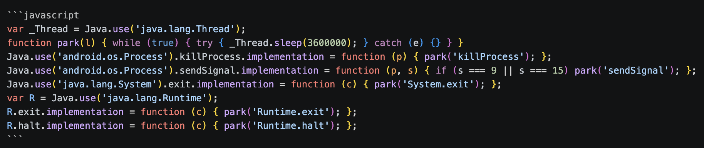
{.big}

### READ THE TRAFFIC

Now that the app stays alive under Frida, I wanted to read its API traffic. Two things were in the way.

First was SSL pinning. The app only trusts its own certificates, so Burp Suite gets rejected and I can't intercept anything. This is the normal kind of pinning (OkHttp plus Conscrypt), so I just hooked the certificate checks and made them accept anything. After that Burp's certificate works and I can see the HTTPS traffic.

But the request bodies were still unreadable, something like {"data":"<base64>","key":"<base64>"}. So there is a second layer of encryption sitting inside the HTTPS. For every request the app makes a random AES key, encrypts the JSON with it, and sends that key along too (wrapped with the server's RSA key). Breaking the encryption itself is not worth it. But I don't have to, because the app's own decrypt function gets the ciphertext and the key in plain form every time. So I hooked that function and the key generator and just printed the key and the decrypted JSON.

Once I had the keys I could also decrypt and re-encrypt the bodies myself with a small openssl script, so I can edit a request and replay it in Burp. After this it was just normal API testing, which was the whole reason I wanted in.

Note: I skipped the explanation part in SSL pinning bypass and Client-Side Encryption because this post's main focus was RASP. I'll write about them in the future maybe, maybe not.

### ANOTHER HINDRANCE: TIMING

There's a hard deadline of roughly 1.5 seconds, and I lost it on maybe a third of cold launches. The timeline:

```
0.00s  process spawned
0.05s  libdrawpanel.so loads (MyApp.<init>)
0.10s  detection thread starts
0.50s  D10002 fires
0.51s  alarm(1) armed
1.51s  SIGALRM delivered → killed
```

My Frida script has to be attached and have `signal(SIGALRM, SIG_IGN)` in place before t=1.51s. The runner just races it: launch the app, poll for its process every 50ms, attach the instant it appears, retry up to 5 times if it loses the race.

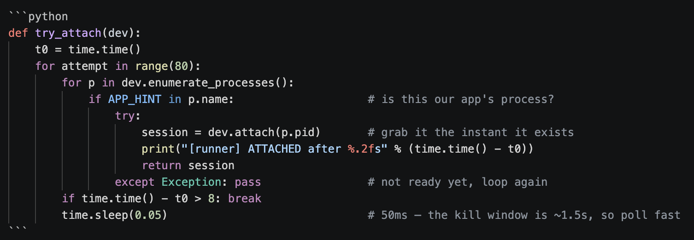
{.big}

Things that helped win the race more often: a freshly rebooted emulator (injection is faster from a clean state), letting the app launch once *without* Frida first so DoveRunner's native libs are already extracted on disk, and that tight 50ms poll.

### IT WORKS!!!!

The proof is just the app continuing to exist. With everything loaded I get

```
[runner] ATTACHED after 1.18s            ← beat the 1.5s SIGALRM window
[LEAN] native hooks installed pid=6095   ← SIGALRM + kill vectors handled
[LEAN] Java.perform fired                ← this is the line that's MISSING when the SIGSEGV scope is wrong
[LEAN] RootBeer hooked
[LEAN] EmulatorDetector hooked
[LEAN] Java hooks installed
[LEAN] DROP sr.hkesg                     ← the kill overlay got intercepted
[BEAT] 5s pid=6095                       ← still alive where it used to die
[BEAT] 10s pid=6095
[BEAT] 15s pid=6095
```

and when I touch a screen that calls an API, the crypto capture fires:

```
[KEY] aes256=4f3c...
[DEC] key=4f3c... pt={"status":"SUCCESS",...}
```

### KNOWLEDGE I GOT

It was really fun doing all this research and implementation. It took me around 24 hours in total to get to this point, and after reaching here I felt achieved and KNOWLEDGEABLE. Took longer than I'd like to admit, but I came out understanding signals, the syscall boundary, and how ART actually works way better than I did going in.


**I used AI a lot during this, and I'm honestly liking it a lot as a pair-pentester. I have a ton of opinions about that and I'll write about it next — but by no means did I do all of this myself.**

Thank you for reading.